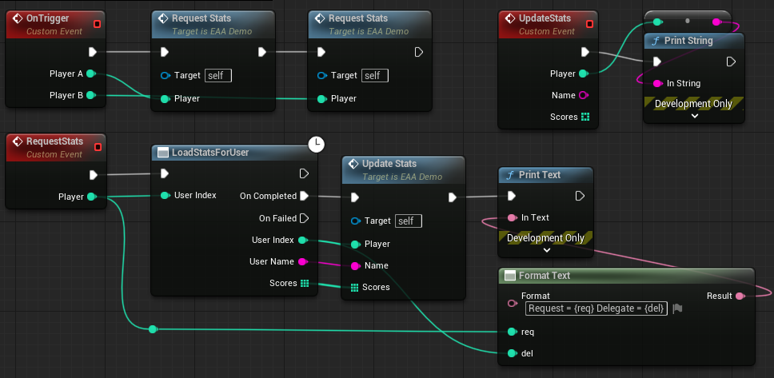
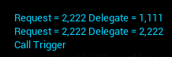
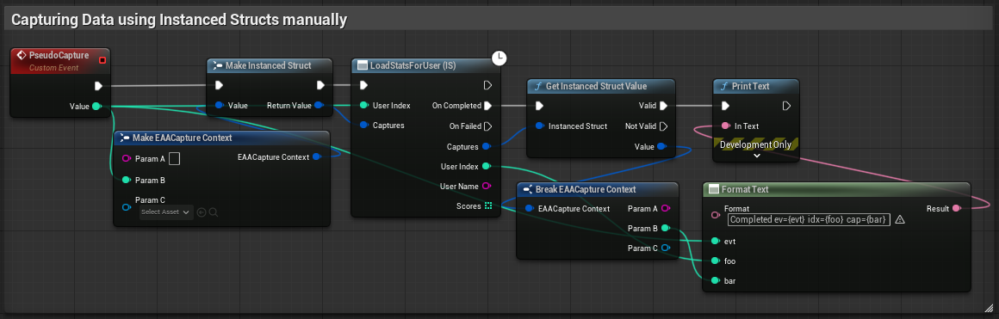
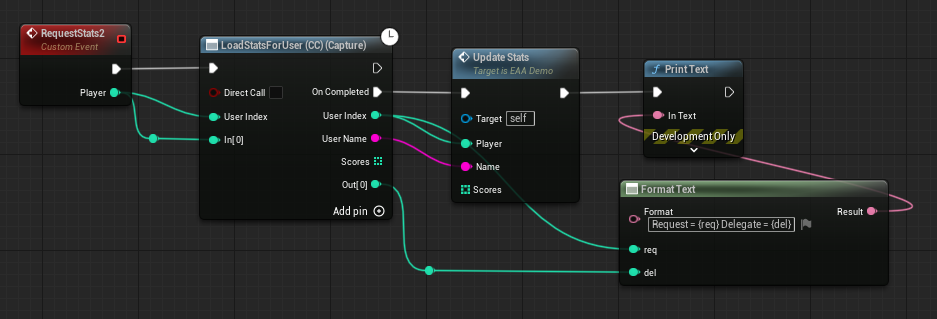
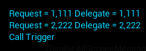
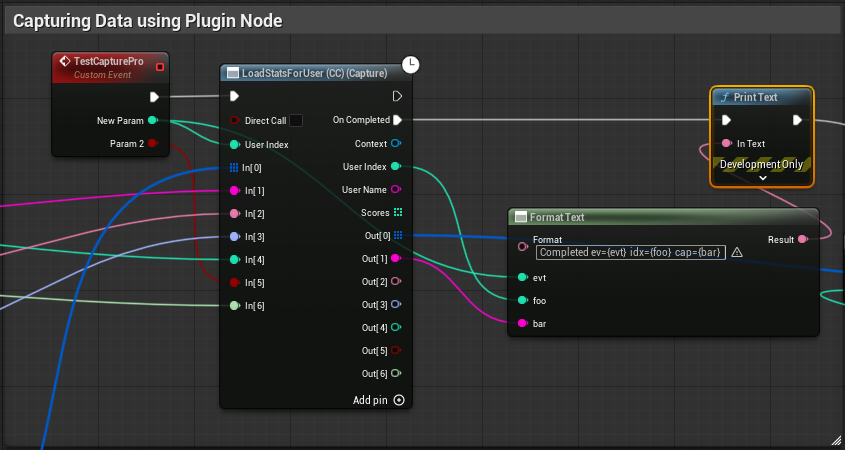

[](https://github.com/aquanox/EnhancedAsyncActionPlugin/blob/main/LICENSE)
[](https://github.com/aquanox/EnhancedAsyncActionPlugin/network)
[](https://github.com/aquanox/EnhancedAsyncActionPlugin/stargazers)


## Enhanced Async Action Plugin for Unreal Engine

> [!NOTE]
> This plugin is Experimental, while being functionally complete there is room for usability improvements and new features.
> 
> Not ready yet for any production use!

This plugin is a proof-of-concept experiment to make blueprint async nodes "capture" state of variables prior to call in a friendly way.

If anyone finds this project interesting feel free to send feedback in Discord.

## The Capture Problem

Due to nature of how "async" actions function in blueprint anyone working with blueprints encountered this problem:



Using value from caller will result in fail:



So how to make capturing work and be usable? 

One of the solutions I saw was using a generic `FInstancedStruct` parameter that was used to pass capture context.

This method works but convenience is lacking.

Structs need to be prepared, 'Make/Break Struct' and 'Make/Get Instanced Struct' nodes. 



```cpp
DECLARE_DYNAMIC_MULTICAST_DELEGATE_FourParams(FExampleResult,
	FInstancedStruct, Captures,
	int32, UserIndex, FString, UserName, const TArray<int32>&, Scores);
	
UCLASS(MinimalAPI)
class UExampleAction : public UBlueprintAsyncActionBase
{
	GENERATED_BODY()
public:
	UPROPERTY(BlueprintAssignable)
	FExampleResult OnCompleted;
	
	UFUNCTION(BlueprintCallable, meta=( BlueprintInternalUseOnly=true,  WorldContext = "WorldContextObject"))
	static UExampleAction* StartAction(const UObject* WorldContextObject, int32 UserIndex, FInstancedStruct Captures);
protected:
	void OnResultReceived(FDataPack& Pack)
	{
	  OnComplete.Broadcast(LocalCaptures, UserIndex, Pack.UserName, Pack.Scores);
	}

	UPROPERTY()
	FInstancedStruct LocalCaptures;
};
```

## The Capture Solution

To provide best convenience when working in Blueprint Graph Editor plugin implements a custom `UK2Node` that matches behavior of engine `UK2Node_AsyncAction` and adding context-managing logic into chain.

To capture unrestricted amount of data while keeping type information `FInstancedPropertyBag` is a great tool, it supports almost any property type and container (even Maps support was added in 5.8).

To be able access proxy object from `Custom Event` one can't simply take the proxy pin (which can be exposed with `ExposedAsyncProxy`) as it will be overwritten on subsequent calls and point to most recent action.
Guaranteed access to proxy object is possible only if proxy passed as delegate parameter.

Custom graph node can be used with any `UBlueprintAsyncAction` class that satisfies following conditions:
- Delegate has a mandatory `const UObject*` parameter that will be used to access proxy from generated `Custom Event`
- Proxy class has metadata `HasAsyncContext` set to context parameter
- Delegate invocation will pass `this` to context parameter 

Optional:
- Proxy can have metadata `HasDedicatedAsyncNode` to prevent it from being used by engine node
- Proxy can house own instance of container for context (see examples)

This how it looks in practice: 

```cpp
DECLARE_DYNAMIC_MULTICAST_DELEGATE_FourParams(FExampleResult,
	const UObject*, Context,
	int32, UserIndex, FString, UserName, const TArray<int32>&, Scores);
	
UCLASS(MinimalAPI, meta=(HasAsyncContext=Context))
class UExampleAction : public UBlueprintAsyncActionBase
{
	GENERATED_BODY()
public:
	UPROPERTY(BlueprintAssignable)
	FExampleResult OnCompleted;
	
	UFUNCTION(BlueprintCallable, meta=( BlueprintInternalUseOnly=true,  WorldContext = "WorldContextObject"))
	static UExampleAction* StartAction(const UObject* WorldContextObject, int32 UserIndex);
protected:
	void OnResultReceived(FDataPack& Pack)
	{
	  OnComplete.Broadcast(this, UserIndex, Pack.UserName, Pack.Scores);
	} 
};
```

In Blueprint Graph Editor node will look like this 



At call site pin value will be stored into capture context, then read at delegate, and produce expected result.



With no limits to amount of data to capture



### Implementation Details (Graph)

**Standard Async Action Flow**

- Call `ProxyFactory::ProxyFactoryFunction` to create new `ProxyClass` instance
- For each multicast delegate in node:
   - Create Custom Event 
   - Call Add Delegate and subscribe to event
   - Call `ProxyClass::Activate`
   - Continue Execution from Then Pin
- For each Custom Event:
  - For each multicast delegate parameter:
    - Assign value to a created local variable
  - Continue execution from Event Pin

**Custom Async Action Flow**

- Call `ProxyFactory::ProxyFactoryFunction` to create new `ProxyClass` instance
- Call `CreateContextForObject` to create bound context for the proxy object
- Call `SetupContext` to configure context property bag (only for non-vararg mode)
- For each capture parameter:
  - Call `SetValue` to capture value
- For each multicast delegate in node:
    - Create Custom Event
    - Call Add Delegate and subscribe to event
    - Call `ProxyClass::Activate`
    - Continue Execution from Then Pin
- For each Custom Event:
  - Call `GetContextForObject` to acquire context for proxy object
  - For each capture parameter output:
    - Call `GetValue` to read captured value
    - Assign value to a created local variable
  - For each multicast delegate parameter:
    - Assign value to a created local variable
    - Continue Execution from Event Pin

**Variadic Async Action Flow**

- Call `ProxyFactory::ProxyFactoryFunction` to create new `ProxyClass` instance
- Call `CreateContextForObject` to create bound context for the proxy object
- Call `SetValueVariadic` to write captures values to storage (pin per captured property)
- For each multicast delegate in node:
  - Create Custom Event
  - Call Add Delegate and subscribe to event
  - Call `ProxyClass::Activate`
  - Continue Execution from Then Pin
- For each Custom Event:
  - Call `GetContextForObject` to acquire context for proxy object
  - Call `GetValueVariadic` to read captured values from storage (pin per captured property)
    - Assign value to a created local variable
  - For each multicast delegate parameter:
    - Assign value to a created local variable
    - Continue Execution from Event Pin

**Standard Latent Action Flow**

- Call `CreateContextForLatent` to create new context
- Call `SetupContext` to configure context property bag (only for non-vararg mode)
- Create local variable for context handle that will be updated by latent action
- Write Properties one of:
  - Call `SetValueVariadic` to write captures values to storage (pin per captured property)
  - Call `SetValue[Type]` to write captures values to storage (one call per captured property)
- Call latent action function
- Read Properties one of:
  - Call `GetValueVariadic` to read captures values from storage (pin per captured property)
  - Call `GetValue[Type]` to read captures values from storage (one call per captured property)
- Call `DestroyContext` to free used resources
- Continue Execution

Context created only if there is at least one capture pin connected.

## TODOS

- Write some tests
- Clean up debug logging
- Improve handling of malformed or changed nodes (there are lots of asserts for debug purposes right now)
- Maps support (has to wait for UE 5.8)

## Unreal Engine Versions

Plugin relies on Instanced Structs usage, requires at least UE 5.5

## License

Plugin is available under the MIT license. See the LICENSE file for more info.
